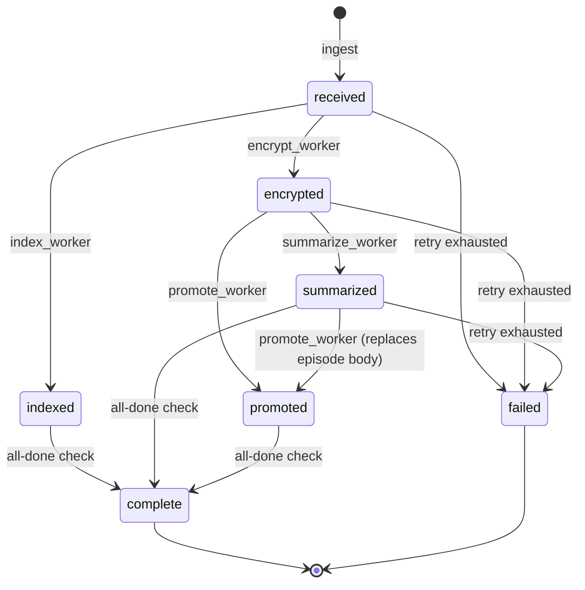

# Conv-Tier 2.0 — Design Spec

**Date:** 2026-05-19
**Status:** Approved — implementation in progress
**Branch:** `feat/conv-tier-2.0`
**Supersedes:** [conv-memory slice 1 (PR #37)](./2026-05-19-conversation-memory-design.md)

## 1. Problem statement

The slice-1 conv tier shipped a working but architecturally compromised
pipeline:

- Daemon thread polling a disk-glob every 1–10s for new summary jobs
- No supervision: if the worker dies, summarization stops silently
- Pipeline state lives implicitly in `summary IS NULL` — no way to tell
  "encrypted but not summarized" from "summarized but not promoted"
- Graphiti promotion runs synchronously inside the write path; if
  Graphiti is slow or down, every inbound is blocked
- No backpressure: a message burst would pile up unboundedly in the queue
  dir
- Ad-hoc retry policy (we patched a dead-letter at 3 retries during F3
  hardening, but every other stage lacks one)
- Observability is grep-the-log only — no trace IDs, no per-stage
  latency, no health surface
- Measured **p50 end-to-end latency: 9.1s** for a 78-char message; ~50%
  of that is the IDLE_POLL_S sleep, not real work

For one user on a Mac mini with ~100 msg/day this is "good enough."
But the moment Flyn captures multiple owners (Beth, Eric) or additional
channels (Slack, Discord), the shortcuts compound:

- A stuck message has no way to surface itself
- A 10x volume burst would queue indefinitely
- Crash recovery requires manual intervention (no resume-from-state)
- Adding a stage (e.g., LLM-classification, PII redaction) means another
  daemon thread + another queue dir + another disk-glob loop

Conv-Tier 2.0 rebuilds the pipeline on principled foundations — workflow
state machine, async worker pool, idempotency, backpressure, supervision,
end-to-end tracing — without changing the externally visible contract
(POST `/api/memory/ingest` with `event_type=conversation_message` still
works the same way for the openclaw plugin).

## 2. Goals and non-goals

### Goals

1. **Latency:** p50 e2e < 2s, p99 < 5s (vs. current p50 9.1s).
2. **Reliability:** crash recovery resumes mid-pipeline messages; worker
   pool auto-restarts on death; data is never lost in a kill -9.
3. **Observability:** every message gets a trace_id; per-stage p50/p99
   surfaced via `/api/memory/conv/health`; stuck messages findable via
   one SQL query.
4. **Backpressure:** queue depth bounded by HIGH_WATER; explicit drop
   policy when exceeded; overload signal emitted to the controller.
5. **Idempotency:** every external call (Ollama, Graphiti) tagged with
   an idempotency key; retries do not corrupt state.
6. **Testability:** state machine has property-based tests; each worker
   is unit-testable in isolation; chaos tests prove crash recovery; load
   tests prove backpressure works at 10x normal volume.
7. **Zero-downtime migration:** v2 ships in shadow mode alongside v1
   for 24h, then cuts over with monitoring.

### Non-goals

- Multi-process scaling (Celery, Dramatiq). For Flyn's load, a single
  Python process with asyncio is sufficient.
- Cross-machine distribution. The Mac mini is the only deployment.
- Replacing the AES-GCM encryption, Keychain key storage, or principals
  model. Those are correct in v1 and carry over.
- Schema migration tooling. We control the only deployment; ad-hoc SQL
  migrations are fine.

## 3. Service-level objectives (SLOs)

Measured on the production Mac mini deployment over a 24h soak.

| Metric | Target | How measured |
|---|---|---|
| p50 end-to-end latency (POST → fully complete) | < 2.0s | `/api/memory/conv/health` rolling 100-message window |
| p99 end-to-end latency | < 5.0s | Same |
| Drop rate (messages refused under load) | < 0.1% | Counter on `HighWaterDropped` events |
| Stuck count (state ≠ complete for > 60s) | 0 | `SELECT count(*) FROM conversation_workflow WHERE state != 'complete' AND created_at < now()-60s` |
| Worker memory growth over 24h | < 50 MB | RSS sampling every 5min |
| Dead-letter rate | < 0.1% per 100 messages | Count of files in `dead-letter/` |

The 2s p50 target is achievable because:
- Ollama gemma4:e4b warm inference is ~1.0–1.5s (measured)
- Pickup latency drops from current ~5s (polling) to ~10ms (async)
- Encryption + DB write + index are <50ms combined

## 4. Architecture overview

```
                        ┌─────────────────────────────────┐
   openclaw plugin ───▶ │ POST /api/memory/ingest         │
   (Telegram /          │  (FastAPI async route)          │
    Discord / etc)      └────────────┬────────────────────┘
                                     │
                                     ▼
                        ┌─────────────────────────────────┐
                        │ ingest_worker (Phase 0)         │
                        │  • assign trace_id              │
                        │  • write row(state=received)    │
                        │  • emit encrypt event           │
                        └────────────┬────────────────────┘
                                     │
                          ┌──────────┴──────────┐
                          ▼                     ▼
                  ┌───────────────┐     ┌───────────────┐
                  │ encrypt       │     │ index         │
                  │ worker        │     │ worker        │
                  │ AES-GCM seal  │     │ FTS5 + body   │
                  └───────┬───────┘     └───────┬───────┘
                          │                     │
                          ▼                     ▼
                  ┌───────────────┐     ┌───────────────┐
                  │ summarize     │     │ promote       │
                  │ worker        │     │ worker        │
                  │ Ollama call   │     │ Graphiti POST │
                  └───────┬───────┘     └───────┬───────┘
                          │                     │
                          └──────────┬──────────┘
                                     ▼
                        ┌─────────────────────────────────┐
                        │ state = complete                │
                        │ trace closed, metrics emitted   │
                        └─────────────────────────────────┘
```

**Key properties:**
- Each worker is an independent asyncio coroutine.
- Workers communicate via typed events (in-process queues, persisted to
  SQLite on enqueue for crash recovery).
- The `encrypt` and `index` stages can run in parallel after `received`.
- The `summarize` and `promote` stages can run in parallel after their
  respective dependencies.
- The orchestrator (supervisor) restarts dead workers and reports health.

## 5. Workflow state machine

### States

```
received   → row written, encryption + index not yet started
encrypted  → AES-GCM ciphertext stored
indexed    → FTS5 entry created
summarized → summary text populated, summarized_at set
promoted   → Graphiti episode created with idempotency_key
complete   → all terminal stages done
failed     → dead-letter — non-recoverable error; admin attention
```

### Transitions

```
received    ── encrypt_worker ──▶  encrypted
received    ── index_worker  ──▶  indexed
encrypted   ── summarize_worker ──▶  summarized
encrypted   ── promote_worker ──▶  promoted  (Graphiti gets ciphertext-aware metadata only)
summarized  ── promote_worker ──▶  promoted  (Graphiti gets summary in episode body)
indexed + summarized + promoted ── orchestrator ──▶  complete
ANY state   ── retry exhausted ──▶  failed
```

The diamond join at `complete` is enforced by a single SQL statement
that flips state to `complete` only when all three sibling fields are
set.

### Diagram (Mermaid)



## 6. Schema design

### messages table (data, append-only — unchanged from v1)

```sql
CREATE TABLE messages (
    id            INTEGER PRIMARY KEY AUTOINCREMENT,
    channel       TEXT NOT NULL,
    sender_id     TEXT NOT NULL,
    thread_id     TEXT,
    reply_to_id   INTEGER,
    ts            TEXT NOT NULL,
    body          TEXT NOT NULL,
    attachments   TEXT,
    summary       TEXT,
    encrypted_raw BLOB NOT NULL
);
```

`summary` remains here as the user-facing read path. The mutable
workflow state lives separately.

### conversation_workflow table (NEW)

```sql
CREATE TABLE conversation_workflow (
    message_id      INTEGER PRIMARY KEY REFERENCES messages(id),
    state           TEXT NOT NULL,              -- received|encrypted|indexed|summarized|promoted|complete|failed
    attempts_encrypt   INTEGER NOT NULL DEFAULT 0,
    attempts_index     INTEGER NOT NULL DEFAULT 0,
    attempts_summarize INTEGER NOT NULL DEFAULT 0,
    attempts_promote   INTEGER NOT NULL DEFAULT 0,
    last_error      TEXT,
    last_error_stage TEXT,
    idempotency_key_summarize TEXT,   -- sent to Ollama for dedup
    idempotency_key_promote   TEXT,   -- sent to Graphiti as episode UUID
    trace_id        TEXT NOT NULL,
    created_at      TEXT NOT NULL,    -- ISO8601 UTC
    encrypted_at    TEXT,
    indexed_at      TEXT,
    summarized_at   TEXT,
    promoted_at     TEXT,
    completed_at    TEXT,
    failed_at       TEXT
);

CREATE INDEX idx_workflow_state ON conversation_workflow(state, created_at);
CREATE INDEX idx_workflow_trace ON conversation_workflow(trace_id);
```

### work_queue table (NEW — durable queue overflow + crash recovery)

```sql
CREATE TABLE work_queue (
    id          INTEGER PRIMARY KEY AUTOINCREMENT,
    stage       TEXT NOT NULL,           -- encrypt|index|summarize|promote
    message_id  INTEGER NOT NULL,
    trace_id    TEXT NOT NULL,
    enqueued_at TEXT NOT NULL,
    attempts    INTEGER NOT NULL DEFAULT 0,
    next_attempt_at TEXT NOT NULL,       -- for exponential backoff
    in_flight_until TEXT                 -- claimed-by-worker lock with timeout
);

CREATE INDEX idx_queue_stage_next ON work_queue(stage, next_attempt_at);
```

### Atomic transition example

```sql
-- Worker claims a job (atomic; uses RETURNING for lock-free pickup)
UPDATE work_queue
   SET in_flight_until = datetime('now', '+30 seconds'),
       attempts = attempts + 1
 WHERE id = (
     SELECT id FROM work_queue
      WHERE stage = ?
        AND (in_flight_until IS NULL OR in_flight_until < datetime('now'))
        AND next_attempt_at <= datetime('now')
      ORDER BY enqueued_at ASC
      LIMIT 1
 )
 RETURNING id, message_id, trace_id, attempts;

-- Worker completes the job: delete the queue row + update workflow state
-- in a transaction so partial failures don't leave inconsistent state.
BEGIN;
DELETE FROM work_queue WHERE id = ?;
UPDATE conversation_workflow
   SET state = 'encrypted',
       encrypted_at = datetime('now'),
       attempts_encrypt = attempts_encrypt + 1
 WHERE message_id = ?;
COMMIT;
```

## 7. Pipeline workers

Each worker is an independent asyncio coroutine. The pool manager
spawns N workers per stage (configurable; default 1 for each).

### IngestWorker (synchronous, in the request handler)

```python
async def ingest(event: InboundEvent) -> EventResult:
    trace_id = make_trace_id()
    async with tx() as conn:
        row_id = await conn.execute(INSERT_MESSAGES, ...)
        await conn.execute(INSERT_WORKFLOW, message_id=row_id, state='received',
                          trace_id=trace_id, created_at=now())
        await conn.execute(INSERT_QUEUE, stage='encrypt', message_id=row_id, ...)
        await conn.execute(INSERT_QUEUE, stage='index', message_id=row_id, ...)
    bus.notify('encrypt'); bus.notify('index')   # wake the workers
    return EventResult(accepted=True, trace_id=trace_id)
```

The notify is a `asyncio.Event.set()` — workers blocked on
`await bus.wait('encrypt')` wake immediately (no polling).

### EncryptWorker, IndexWorker, SummarizeWorker, PromoteWorker

```python
async def run_loop(stage: str, bus, db, deps):
    while not bus.is_stopping():
        job = await db.claim_next_job(stage)
        if job is None:
            await bus.wait(stage)             # block until notified
            continue
        try:
            with trace_span(stage, job.trace_id):
                await deps.handle(job)        # stage-specific work
            await db.complete_job(job)
            for next_stage in NEXT_STAGES[stage]:
                bus.notify(next_stage)
        except Exception as exc:
            await db.fail_job(job, exc, max_attempts=3)
```

Stage-specific handlers:

- `EncryptHandler.handle`: read body, call `encrypted_raw.seal`,
  UPDATE messages SET encrypted_raw=?, workflow state → encrypted
- `IndexHandler.handle`: insert FTS5 row (already done by trigger in v1;
  in v2 we make it explicit so workflow tracks it)
- `SummarizeHandler.handle`: call Ollama with idempotency_key, on
  success UPDATE messages SET summary=?, workflow state → summarized
- `PromoteHandler.handle`: POST Graphiti episode with idempotency_key
  as episode UUID, workflow state → promoted

All four read `messages.body` to do their work; only `encrypt` writes
to `messages` (besides the initial ingest row).

## 8. Work queue

### In-memory layer: asyncio.Queue

Per-stage `asyncio.Queue` instances. Workers `await queue.get()` for
sub-millisecond pickup latency. Producers (other workers + ingest)
call `queue.put_nowait(job_id)`.

### Persistent layer: SQLite-backed work_queue table

Every enqueue writes a row before notifying. On crash recovery, on
startup the supervisor scans `work_queue` for rows where
`in_flight_until < now()` (stale claims) or `in_flight_until IS NULL`
and re-enqueues them to the in-memory queue.

This makes the queue durable without committing to a full message
broker like Redis or RabbitMQ.

### Backpressure

```python
HIGH_WATER = int(os.environ.get("FLYN_CONV_HIGH_WATER", "1000"))
DROP_POLICY = os.environ.get("FLYN_CONV_DROP_POLICY", "reject_new")
# valid: "reject_new" | "drop_oldest" | "drop_newest"

async def ingest(event):
    depth = await db.queue_depth_total()
    if depth >= HIGH_WATER:
        if DROP_POLICY == "reject_new":
            raise HTTPException(503, "conv tier at capacity")
        elif DROP_POLICY == "drop_oldest":
            await db.drop_oldest_queued()
        # ... etc
        await metrics.inc("conv_overload_drop_total", policy=DROP_POLICY)
    ...
```

When the system is overloaded, an `overload_signal` is emitted via
`/api/memory/conv/health` and via a structured log line that the
controller (openclaw) can react to (e.g., throttle the channel poller).

## 9. Observability

### Structured logging

Every log line emitted by conv-tier 2.0 includes:

```json
{
  "ts": "2026-05-19T22:54:27.91Z",
  "level": "info",
  "trace_id": "tr-abc123def456",
  "message_id": 47,
  "stage": "summarize",
  "outcome": "success",
  "duration_ms": 1234,
  "attempt": 1
}
```

Trace ID is generated at ingest and flows through every subsequent
log line for that message. `grep tr-abc123 /tmp/conv-router.log`
shows the full pipeline for one message.

### Health endpoint

```
GET /api/memory/conv/health
{
  "queue_depths": {
    "encrypt": 0,
    "index": 0,
    "summarize": 3,
    "promote": 12
  },
  "latency_ms": {
    "encrypt": {"p50": 5,    "p99": 12},
    "index":   {"p50": 8,    "p99": 18},
    "summarize": {"p50": 1500, "p99": 4500},
    "promote": {"p50": 800,  "p99": 2200},
    "end_to_end": {"p50": 1800, "p99": 4900}
  },
  "stuck": {
    "encrypt": 0,
    "index": 0,
    "summarize": 1,
    "promote": 0
  },
  "dead_letter_count": 0,
  "workers_alive": {
    "encrypt": 1,
    "index": 1,
    "summarize": 1,
    "promote": 1
  },
  "overload": {
    "active": false,
    "policy": "reject_new",
    "last_drop_at": null
  }
}
```

`stuck` counts messages whose state has not advanced in > 60s. A
`stuck > 0` is the operator's alert that something needs attention.

### Prometheus metrics endpoint

```
GET /api/memory/conv/metrics
# HELP conv_ingest_total Total messages ingested
# TYPE conv_ingest_total counter
conv_ingest_total{channel="telegram"} 47

# HELP conv_stage_latency_ms Per-stage latency histogram
# TYPE conv_stage_latency_ms histogram
conv_stage_latency_ms_bucket{stage="summarize",le="500"} 12
conv_stage_latency_ms_bucket{stage="summarize",le="1000"} 28
...

# HELP conv_dead_letter_total Messages moved to dead-letter
# TYPE conv_dead_letter_total counter
conv_dead_letter_total{stage="summarize",reason="ollama_timeout"} 0
```

Standard Prometheus format; scrapeable by any Prom-compatible system
(or just inspectable by curl).

### Diagnostic SQL

```sql
-- All stuck messages with last error
SELECT m.id, w.state, w.last_error_stage, w.last_error,
       w.created_at, (julianday('now') - julianday(w.created_at)) * 86400 as age_seconds
  FROM conversation_workflow w
  JOIN messages m ON m.id = w.message_id
 WHERE w.state NOT IN ('complete', 'failed')
   AND w.created_at < datetime('now', '-60 seconds')
 ORDER BY w.created_at;

-- Throughput per hour
SELECT strftime('%Y-%m-%d %H:00', created_at) as hour, count(*) as ingested
  FROM conversation_workflow
 GROUP BY hour
 ORDER BY hour DESC LIMIT 24;
```

## 10. Idempotency and retries

### Idempotency keys

- **Summarize:** `idempotency_key_summarize` = `sha256(message_id + body)[:16]`.
  Stored in workflow row; sent to Ollama (Ollama doesn't actually use
  it but the row provides our own dedup if a worker retries mid-call).
- **Promote:** `idempotency_key_promote` = same hash but for Graphiti.
  Used as the episode UUID so Graphiti dedupes natively on second POST.

### Retry policy

```python
RETRY_POLICY = {
    "encrypt":   {"max_attempts": 5, "backoff_base_s": 0.5, "backoff_max_s": 10},
    "index":     {"max_attempts": 5, "backoff_base_s": 0.5, "backoff_max_s": 10},
    "summarize": {"max_attempts": 3, "backoff_base_s": 2,   "backoff_max_s": 60},
    "promote":   {"max_attempts": 3, "backoff_base_s": 2,   "backoff_max_s": 60},
}

# attempt N is delayed by min(base * 2^(N-1), max) seconds
```

When `attempts > max_attempts`, the job is moved to the dead-letter
table (separate `dead_letter_queue` table) and state → `failed`. A
human investigates from `conv conv dead-letter list` CLI subcommand.

### Replay-safe operations

- Encrypt: writing the same ciphertext over itself is idempotent.
- Index: FTS5 INSERT-OR-REPLACE by rowid.
- Summarize: UPDATE messages SET summary = ? — last write wins, no
  duplicate side effects.
- Promote: Graphiti dedupes via episode UUID.

Re-running any stage will not corrupt state.

## 11. Reliability

### Worker supervision

```python
class WorkerSupervisor:
    def __init__(self, stages: dict[str, int]):
        self._tasks: dict[str, list[Task]] = {}
        self._stages = stages   # stage_name → concurrency

    async def start(self):
        for stage, n in self._stages.items():
            self._tasks[stage] = [
                asyncio.create_task(self._supervise(stage, i))
                for i in range(n)
            ]

    async def _supervise(self, stage: str, worker_idx: int):
        while not self._stopping:
            try:
                await run_worker(stage)
            except Exception as exc:
                logger.error("worker %s/%d died: %s", stage, worker_idx, exc)
                metrics.inc("conv_worker_crash_total", stage=stage)
                await asyncio.sleep(1)   # brief backoff before restart
```

If a worker raises an unexpected exception, the supervisor logs it,
emits a metric, waits 1s, then restarts that worker. The pool size is
preserved.

### Graceful shutdown

```python
async def shutdown(timeout: float = 30):
    # 1. Stop accepting new ingest requests
    app.state.shutting_down = True

    # 2. Drain in-memory queues into work_queue table (already done at
    #    enqueue; this is a safety net)
    await flush_in_memory_queues_to_disk()

    # 3. Wait for in-flight workers to finish current job
    for stage, tasks in supervisor.tasks.items():
        await asyncio.wait_for(asyncio.gather(*tasks), timeout=timeout/4)

    # 4. Exit clean — work_queue table has all remaining jobs persisted
```

### Crash recovery

On startup:

```python
async def recover():
    # Re-enqueue work_queue rows whose in_flight_until expired
    n = await db.execute(
        "UPDATE work_queue SET in_flight_until = NULL "
        "WHERE in_flight_until IS NOT NULL AND in_flight_until < datetime('now')"
    )
    logger.info("crash recovery: re-enqueued %d in-flight jobs", n)

    # Verify no workflow row is stuck mid-state with no queue entry
    orphans = await db.find_orphaned_workflows()
    for o in orphans:
        await db.re_enqueue(o.next_pending_stage)
    logger.info("crash recovery: re-enqueued %d orphaned workflows", len(orphans))
```

## 12. Migration plan (v1 → v2)

### Phase 1: Shadow mode (1-2 days)

- Deploy v2 alongside v1. Both receive the same `/api/memory/ingest`
  POST.
- v1 owns the `messages` table writes.
- v2 writes to a parallel `messages_v2` table + `conversation_workflow`
  table, fed by a sniff of the ingest stream.
- Both pipelines run independently. Compare outputs.

### Phase 2: Output validation

- Sample 100 messages over the 24h soak.
- Verify v1 and v2 produced equivalent encrypted ciphertext (modulo
  nonce randomness), equivalent summaries (allow for LLM variance),
  equivalent Graphiti episodes (modulo timestamp).
- Compare timing: v2 p50/p99 should beat v1.

### Phase 3: Cutover

- Flip ingest endpoint to write only to v2 paths.
- v1 daemon thread stopped.
- `messages_v2` table renamed to `messages`; old `messages` archived as
  `messages_v1_archived` for 30 days.
- Monitor stuck count + dead-letter rate for 24h post-cutover.

### Phase 4: Cleanup

- 30 days after cutover, drop `messages_v1_archived`.
- Remove v1 code paths (summarizer.py daemon thread, queue dir polling).
- Update install.sh to skip the v1 queue dir setup.

## 13. Testing strategy

### Unit tests

- **State machine** (property-based): for every (from_state, event)
  pair, the (to_state) is deterministic. Hypothesis library generates
  arbitrary sequences and verifies invariants.
- **Each worker handler**: with mocked Ollama / Graphiti, verify correct
  state transitions for success, transient-failure, exhausted-retry.
- **Queue claims**: concurrent claim attempts from N workers result in
  exactly one winner per job; no double-processing.

### Integration tests

- `IngestWorker → EncryptWorker → SummarizeWorker → PromoteWorker`
  end-to-end with stubs for Ollama (returns canned response) and
  Graphiti (in-memory). Asserts row reaches state=complete.
- Backpressure: enqueue HIGH_WATER+1 messages, verify policy applied,
  metric incremented.

### Chaos tests

- `kill -9` during each stage: verify on restart, message reaches
  state=complete (or state=failed with full error trail).
- Network failure mid-Ollama-call: verify retry succeeds and no
  duplicate summary.
- Disk full during DB write: verify worker logs error, retries when
  space returns.

### Load tests

- 10x normal volume (1000 messages in 10 minutes). Verify:
  - End-to-end p99 stays under SLO.
  - Queue depth peaks below HIGH_WATER (or backpressure kicks in).
  - Worker memory bounded.
  - No data lost.

### End-to-end timing assertions

```python
@pytest.mark.asyncio
async def test_e2e_p99_under_5s():
    # Send 100 synthetic messages, measure each's complete_at - created_at.
    latencies = []
    for i in range(100):
        resp = await client.post("/api/memory/ingest", json=make_msg(i))
        msg_id = resp.json()["message_id"]
        await wait_for_state(msg_id, "complete", timeout=30)
        latencies.append(elapsed(msg_id))
    p99 = numpy.percentile(latencies, 99)
    assert p99 < 5000, f"p99={p99}ms exceeds SLO 5000ms"
```

## 14. Open questions

### Q1: Where does `summary IS NULL` short-circuit go?

In v1 (F3), we discussed skipping Ollama for short messages (use body
as summary). In v2 this becomes a configuration setting on the
summarize stage:

```python
SUMMARIZE_MIN_BODY_LEN = int(os.environ.get("FLYN_CONV_SUMMARIZE_MIN_LEN", "80"))

class SummarizeHandler:
    async def handle(self, job):
        msg = await db.get_message(job.message_id)
        if len(msg.body) < SUMMARIZE_MIN_BODY_LEN:
            summary = msg.body   # short-circuit; no Ollama call
        else:
            summary = await ollama.summarize(msg.body)
        await db.update_summary(job.message_id, summary)
        await db.advance_state(job.message_id, "summarized")
```

**Decision: include in v2.** It's a 6-line change with significant
latency benefit for the common case.

### Q2: Should `encrypt` and `index` be a single combined stage?

They're cheap and both fire on `received`. Combining them simplifies the
state machine. Counterargument: separate stages make per-stage metrics
more useful, and adding future stages (PII redaction, etc.) is easier.

**Decision: keep separate.** Cost is minimal; flexibility is high.

### Q3: How does the openclaw plugin signal a "channel disconnect" so we
can drain gracefully?

Currently the plugin POSTs to `/api/memory/ingest` and the connection
ends. There's no "channel going away" signal. If openclaw restarts, in-
flight HTTP requests fail but the plugin doesn't notify the router.

**Decision: out of scope for v2.** v2 handles its own crash recovery;
the plugin's responsibility is just "POST and forget" with retry on
failure.

### Q4: Should Graphiti promotion include the encrypted_raw blob?

No. Graphiti gets:
- `body` (redacted, suitable for entity extraction)
- `summary` (LLM-generated)
- metadata (channel, thread_id, ts)

The encrypted_raw stays in SQLite only. Graphiti is for entity
extraction and graph traversal; it doesn't need the original payload.

### Q5: How does the openclaw plugin learn about overload?

When `/api/memory/ingest` returns 503 (overload), the plugin logs and
gives up — does NOT retry (we'd just re-overload). The next channel
inbound triggers a fresh attempt; by then the queue may have drained.

The plugin already swallows forward errors silently (per its design),
so no plugin change needed.

## 15. Decisions log

| # | Decision | Date | Rationale |
|---|---|---|---|
| 1 | Single-process asyncio, no Celery | 2026-05-19 | Flyn scale is ~100 msg/day; multi-process adds operational burden without benefit |
| 2 | SQLite for both data + work queue | 2026-05-19 | Already deployed; no new dependency; durable; transactional |
| 3 | Workflow state separate from messages table | 2026-05-19 | Decouples lifecycle from data; enables schema-stable migrations |
| 4 | Trace IDs throughout | 2026-05-19 | Single-message debugging is the #1 operator need |
| 5 | Short-message short-circuit | 2026-05-19 | Common case; significant latency win; trivial to implement |
| 6 | Shadow-mode migration (parallel run) | 2026-05-19 | Zero-downtime requirement; validates v2 outputs match v1 before cutover |

## 16. References

- v1 conv-memory design: `2026-05-19-conversation-memory-design.md`
- v1 ship-gate rubric: `deploy/outcomes/CONV-MEMORY-SLICE-1-RUBRIC.md`
- F1–F5 hardening commits (which informed v2's failure modes):
  `44e0773 fix(memory-router): conv-tier hardening`
- PR #37 (slice-1): `feat/conv-memory-telegram-slice-1`
- Openclaw plugin SDK hook types:
  `/opt/homebrew/lib/node_modules/openclaw/dist/plugin-sdk/src/plugins/hook-types.d.ts`
